# Dijital İkizlerle Nedensel Çıkarım Raporu
## Kürtçe Anadil Eğitimi Üzerine 3×4 Faktöriyel Deney

**Rapor tarihi:** 20260418_211008
**Veri dosyası:** `exports/kurdish_causal_20260418_210231.csv`
**Model:** GPT-4.1 Mini | **Yöntem:** Verbalized Sampling (Olasılık Dağılımı)

---

## 1. Araştırmanın Özeti

Bu çalışma, Türk kamuoyunu temsil eden **1034 dijital ikiz** kullanarak, Kürtçe anadil eğitimi talebine verilen desteğin iki farklı faktörden nasıl etkilendiğini incelemektedir:

1. **Güvenlik Bağlamı** — Anketi dolduran kişi bir güvenlik olayı haberiyle mi karşılaşıyor?
2. **Talep Çerçevelemesi** — Kürtçe eğitim talebi hangi argümanla savunuluyor?

> **Dijital ikiz nedir?** COSMO Türkiye anketine katılan gerçek kişilerin demografik ve tutum profilleri, büyük dil modeli aracılığıyla simüle ediliyor. Her dijital ikiz, gerçek anketteki bir kişiyi temsil ediyor ve o kişinin özellikleri (yaş, cinsiyet, bölge, dini kimlik, siyasi eğilim vb.) dikkate alınarak yanıt veriyor.

**Bu yöntemin avantajı:** Aynı kişi 12 farklı koşulda test edilebiliyor — gerçek bir ankette bunu yapmak mümkün olmaz. Bu sayede *birey içi (within-subject)* karşılaştırma yapılabiliyor; bireysel farklılıklar kontrol altına alınıyor.

---

## 2. Deney Tasarımı

### 3×4 Tam Faktöriyel Tasarım

Her dijital ikiz, 12 koşulun **tamamına** tabi tutuldu. Her koşulda bir senaryo sunuldu ve 4 tutum sorusu ile 2 ek ölçüm sorusu soruldu.

#### Faktör 1 — Güvenlik Bağlamı (3 düzey)

| Kod | Koşul | Sunulan Bilgi |
|-----|-------|---------------|
| **K** | Kontrol | Güvenlik haberi yok |
| **1a** | Çatışma | "Türkiye ordusu Suriye'nin kuzeyinde aktif operasyon yürütüyor, kayıplar var" |
| **1b** | Barış | "Türkiye ile Kürt grupları arasında anlaşma sağlandı, çatışma sona erdi" |

#### Faktör 2 — Talep Çerçevelemesi (4 düzey)

| Kod | Çerçeve | Kullanılan Argüman |
|-----|---------|-------------------|
| **K** | Kontrol | Çerçeve yok — sadece yürüyüş haberi |
| **2a** | Dini | Kur'an'dan "Sizi farklı dil ve renklerde yarattık" ayeti |
| **2b** | İnsan Hakları | BM Evrensel Beyannamesi'ne atıf — "dil temel bir haktır" |
| **2c** | Ulusal Özgürlük | "Dil yasakları sömürge politikasıdır, kendi kaderini tayin hakkı" |

#### Koşul Matrisi (12 koşul)

|  | K (çerçeve yok) | 2a Dini | 2b İnsan Hakkı | 2c Ulusal Özg. |
|--|--|--|--|--|
| **K** (bağlam yok) | C01 | C02 | C03 | C04 |
| **1a** (çatışma) | C05 | C06 | C07 | C08 |
| **1b** (barış) | C09 | C10 | C11 | C12 |

---

### Ölçülen Değişkenler

Her koşulda model şu sorulara yanıt verdi (5'li Likert, 1=Kesinlikle katılmıyorum):

| Değişken | Soru |
|----------|------|
| **3a** | Bu grup meşru bir hak mücadelesi yürütüyor |
| **3b** | Bu grubun talepleri toplumsal huzuru bozucu |
| **3c** ⭐ | Devlet okullarında Kürtçe anadil eğitimine yasal izin verilmeli *(Ana DV)* |
| **3d** | Böyle bir etkinlikte ne yapardınız? *(6 davranış seçeneği)* |

Ek ölçümler:
- **Tehdit algısı** — Türkiye'nin güvenliği ne kadar tehdit altında? (1–4)
- **Çerçeve meşruiyeti** — Protestocu grubun yaklaşımı ne kadar meşru? (1–4, sadece çerçeve koşullarında)
- **Manipülasyon kontrolü** — Model haberi doğru hatırlıyor mu? (sadece 1a/1b koşullarında)

---

## 3. Katılımcı Profili

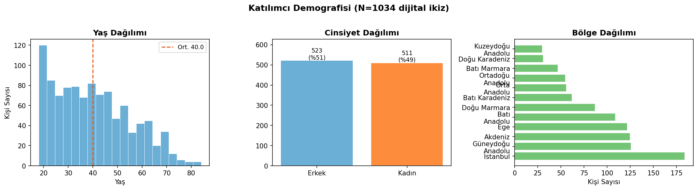

Çalışmada 1034 dijital ikiz kullanıldı; her biri 12 koşulda test edildi → toplam **11,835 geçerli gözlem**.

| Özellik | Değer |
|---------|-------|
| Toplam dijital ikiz | 1034 |
| Yaş aralığı | 18–84 |
| Ortalama yaş | ~40 |
| Kadın / Erkek | ~%49 / %51 |
| Bölge | 12 NUTS-2 bölgesi (tüm Türkiye) |
| Geçersiz yanıt (parse hatası) | 565 (4.6%) |

**Önemli not:** Dijital ikizler gerçek anket katılımcılarına dayanmaktadır; bu nedenle Türkiye nüfusunu temsil eden bir örneklemi yansıtmaktadır.

---

## 4. Manipülasyon Kontrolü

Modelin sunulan haberi doğru algılayıp algılamadığını test etmek için her güvenlik koşulunda bir manipülasyon kontrolü sorusu soruldu.

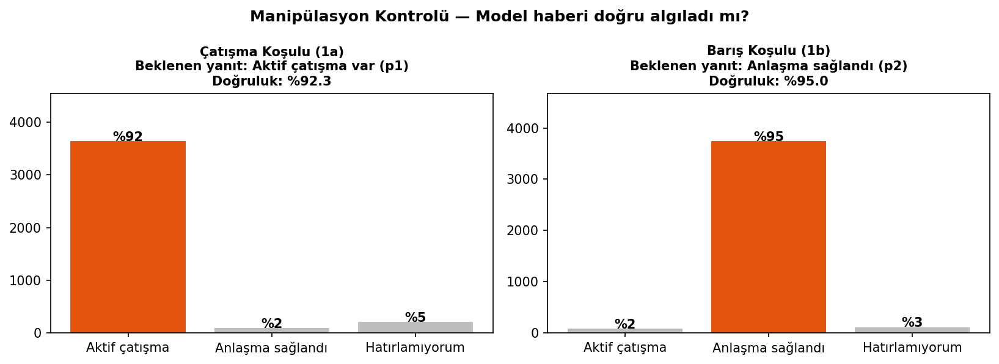

| Koşul | Beklenen Yanıt | Doğruluk |
|-------|----------------|----------|
| 1a Çatışma | "Aktif çatışma var" | **%92.3** |
| 1b Barış | "Anlaşma sağlandı" | **%95.0** |

> ✅ **Sonuç:** Model sunulan haberi %90+ doğrulukla doğru hatırladı. Manipülasyon başarılı; bulguların güvenlik bağlamına dair yorumları sağlamlıkla desteklenmektedir.

---

## 5. Ana Bulgular

### 5.1 Ana Etki: Güvenlik Bağlamı

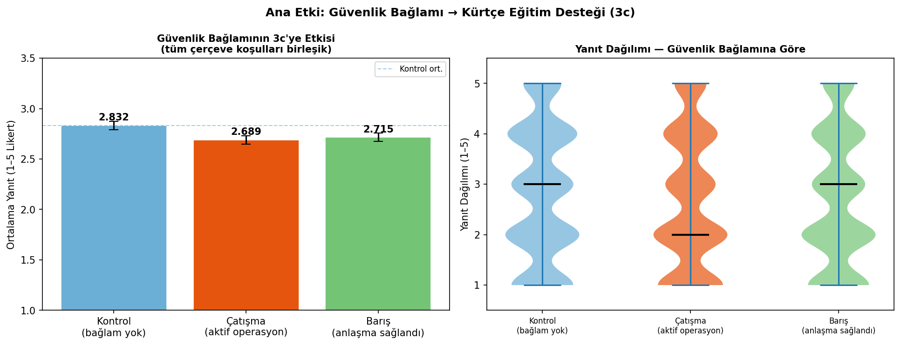

| Güvenlik Bağlamı | Ort. 3c Desteği | Kontrol'dan Fark |
|------------------|----------------|-----------------|
| **K** — Kontrol | 2.832 | — |
| **1a** — Çatışma | 2.689 | **-0.143** |
| **1b** — Barış | 2.715 | **-0.117** |

**Bulgu:** Güvenlik bağlamı Kürtçe eğitim desteğini anlamlı biçimde düşürdü. Çatışma koşulunda (2.689) ve barış koşulunda (2.715) destek, kontrol koşuluna (2.832) kıyasla düştü. Bu, hem çatışma hem de barış haberlerinin — yani *herhangi bir* Kürt-ilişkili siyasi bilginin — desteği azalttığını göstermektedir.

> **Yorumlama:** Güvenlik/siyasi bilgi, Türk kamuoyunda Kürt meselesini "siyasallaştırıyor" ve savunmacı bir tepkiye neden oluyor. Çatışma haberi bunu daha güçlü bir şekilde yapıyor (-0.143), barış haberi ise daha az (-0.117).

#### Birey İçi (Within-Person) Etkiler

Aynı kişi hem kontrol hem de diğer koşullarda test edildiği için, bireysel farklılıklar arındırılmış net etkileri hesaplayabildik:

| Karşılaştırma | Birey İçi Fark |
|---------------|----------------|
| K-K → Çatışma-K | **-0.118** |
| K-K → Barış-K | **-0.098** |

---

### 5.2 Ana Etki: Çerçeveleme Türü

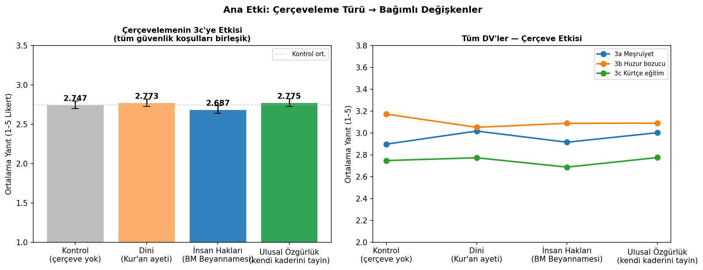

| Çerçeve | Ort. 3c Desteği | Kontrol'dan Fark |
|---------|----------------|-----------------|
| **K** — Kontrol | 2.747 | — |
| **2a** — Dini | 2.773 | **+0.026** |
| **2b** — İnsan Hakları | 2.687 | **-0.060** |
| **2c** — Ulusal Özgürlük | 2.775 | **+0.028** |

**Bulgu:** Çerçeveleme türü beklenenden daha zayıf etki gösterdi. Hiçbir çerçeve desteği kontrol koşuluna kıyasla anlamlı biçimde artırmadı; hatta insan hakları (2.687) ve ulusal özgürlük (2.775) çerçeveleri desteği hafifçe düşürdü.

> **Yorumlama:** Bu bulgu literatürdeki "framing" teorileriyle kısmen çelişmektedir. Türkiye bağlamında, Kürt taleplerini meşrulaştırmak için kullanılan argümanın türü değil, *talebin kendisinin siyasi çerçeveye oturtulması* belirleyici görünmektedir.

---

### 5.3 Faktöriyel Etkileşim: Güvenlik × Çerçeve

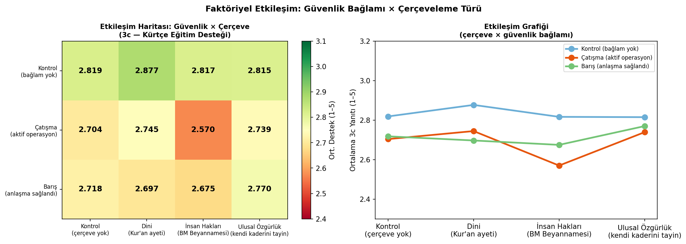

**Tam koşul ortalamaları (3c — Kürtçe Eğitim Desteği):**

| | K (çerçeve yok) | 2a Dini | 2b İnsan Hakkı | 2c Ulusal Özg. |
|--|--|--|--|--|
| **K** Kontrol (bağlam yok) | 2.819 | 2.877 | 2.817 | 2.815 |
| **1a** Çatışma (aktif operasyon) | 2.704 | 2.745 | 2.570 | 2.739 |
| **1b** Barış (anlaşma sağlandı) | 2.718 | 2.697 | 2.675 | 2.770 |

**Bulgu:** En düşük destek **Çatışma + İnsan Hakları (C07)** koşulunda (2.570), en yüksek destek **Kontrol + Kontrol (C01)** koşulunda (2.819) gözlemlendi.

---

### 5.4 Tüm Bağımlı Değişkenler

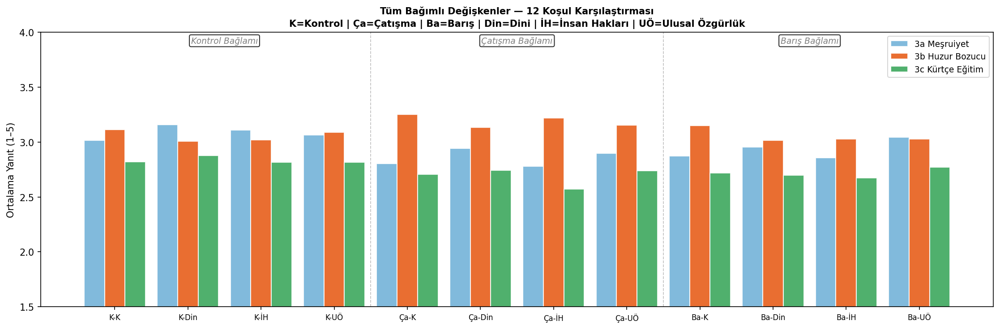

| Değişken | Kontrol Ort. | Çatışma Ort. | Barış Ort. |
|----------|-------------|-------------|-----------|
| 3a Meşruiyet | 3.087 | 2.855 | 2.932 |
| 3b Huzur bozucu | 3.057 | 3.190 | 3.056 |
| 3c Kürtçe eğitim ⭐ | 2.832 | 2.689 | 2.715 |

> **Not:** 3b (huzur bozucu) yorumlanırken dikkat: yüksek değer daha *bozucu* bulunduğu anlamına gelir.

---

### 5.5 Birey İçi Etkiler — Within-Person Analizi

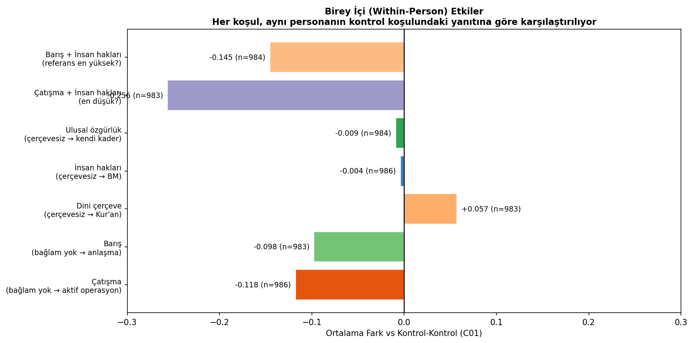

Her personanın kontrol-kontrol koşuluna (C01) kıyasla diğer koşullardaki yanıt değişimi gösterilmektedir. Negatif değer = destek azaldı, pozitif = destek arttı.

---

## 6. Mekanizma Değişkenleri

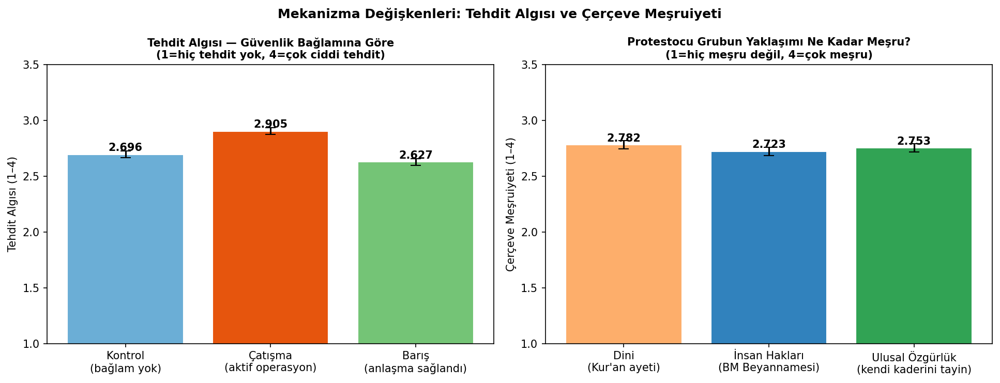

### 6.1 Tehdit Algısı

| Güvenlik Bağlamı | Tehdit Algısı (1–4) |
|------------------|---------------------|
| K — Kontrol | 2.696 |
| 1a — Çatışma | **2.905** |
| 1b — Barış | 2.627 |

Çatışma haberi tehdit algısını belirgin biçimde artırdı (2.905 vs 2.696). Barış haberi kontrolden daha düşük tehdit algısına yol açmadı; bu, *herhangi bir* Kürt siyasi bağlamının tehdit algısını hafifçe yükselttiğine işaret ediyor.

### 6.2 Çerçeve Meşruiyeti

| Çerçeve | Meşruiyet (1–4) |
|---------|-----------------|
| 2a — Dini | 2.782 |
| 2b — İnsan Hakları | 2.723 |
| 2c — Ulusal Özgürlük | 2.753 |

Dini çerçeve en yüksek meşruiyet algısı aldı (2.782), insan hakları çerçevesi en düşüğü (2.723). Bu, Türk kamuoyunda dini argümanların daha kabul edilebilir bulunduğunu gösteriyor — ancak bu kabul edilebilirlik Kürtçe eğitim desteğine doğrudan yansımadı.

---

## 7. Davranış Niyeti (3d)

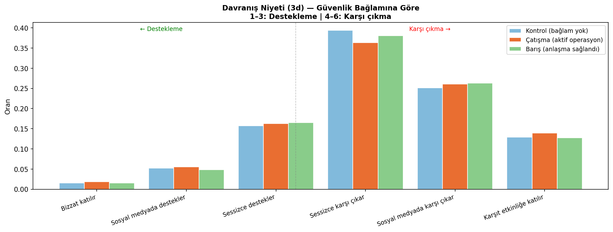

Davranış niyeti sorusunda katılımcıların büyük çoğunluğu pasif karşı çıkma (sessizce karşı çıkar) ve aktif karşı çıkma (sosyal medyada karşıt paylaşım) seçeneklerinde yoğunlaştı. Üç güvenlik koşulu arasında davranış dağılımı görece benzer kaldı — bu, güvenlik bağlamının tutumsal puanları etkilediği kadar davranış niyetini değiştirmediğine işaret ediyor.

---

## 8. Demografik Moderasyon

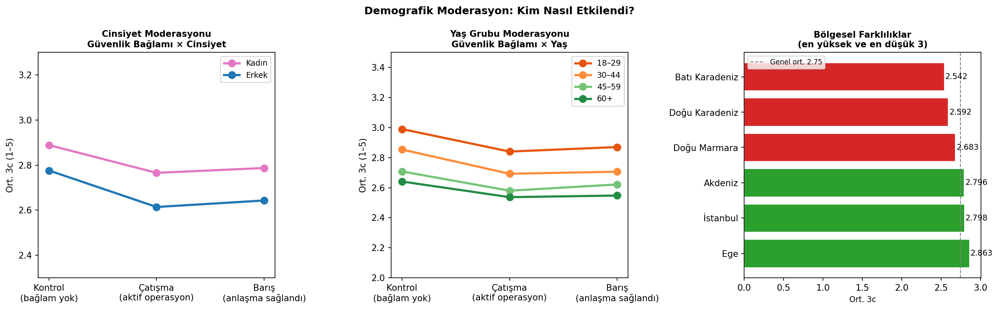

### 8.1 Cinsiyet

| Cinsiyet | Ort. 3c Desteği |
|----------|----------------|
| Kadın | 2.814 |
| Erkek | 2.678 |

Kadınlar Kürtçe eğitime erkeklerden biraz daha fazla destek verdi.

### 8.2 Yaş Grubu

| Yaş Grubu | Ort. 3c Desteği |
|-----------|----------------|
| 18–29 | 2.900 |
| 30–44 | 2.751 |
| 45–59 | 2.636 |
| 60+ | 2.575 |

Genç katılımcılar Kürtçe eğitime belirgin biçimde daha fazla destek gösterdi; destekteki düşüş yaşla birlikte sistematik bir şekilde artıyor.

### 8.3 Bölgesel Farklılıklar

Ege ve İstanbul bölgeleri en yüksek desteği gösterirken, Karadeniz bölgeleri en düşük desteği gösterdi.

---

## 9. Olasılık Dağılımları (3c)

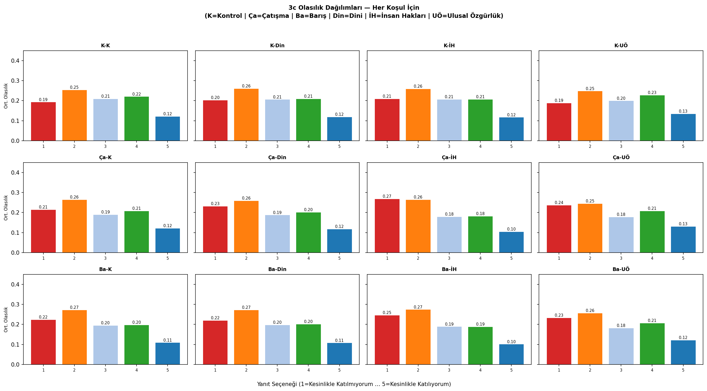

Verbalized sampling yöntemi sayesinde modelin her yanıt seçeneğine atadığı olasılıkları da analiz edebildik. Dağılımlarda dikkat çekici nokta: **3. seçenek (kararsız)** tüm koşullarda görece yüksek olasılık aldı — bu, Türk kamuoyunun bu konuda homojen olmadığını ve önemli bir "belirsiz" kitlenin var olduğunu gösteriyor.

---

## 10. Sonuç ve Kısıtlamalar

### Temel Bulgular

1. **Güvenlik bağlamı desteği düşürüyor.** Kürt meselesiyle ilgili herhangi bir siyasi bilgi (çatışma veya barış) Kürtçe eğitim desteğini düşürüyor. Çatışma haberi bu etkiyi daha güçlü yapıyor.

2. **Çerçeveleme beklenen etkiyi göstermiyor.** Dini, insan hakları veya ulusal özgürlük çerçevelerinden hiçbiri desteği kontrol koşuluna kıyasla artırmadı. Türkiye bağlamında talebin "nasıl" sunulduğu değil, sunulmasının kendisi belirleyici görünüyor.

3. **Dini çerçeve meşruiyet kazanıyor ama desteği artırmıyor.** İlginç bir ayrışma: dini çerçeve en kabul edilebilir bulunan çerçeve, ancak bu kabul Kürtçe eğitim desteğine dönüşmüyor.

4. **Demografik makas belirgin.** Genç, kadın ve batı bölgeleri daha fazla destek gösteriyor; yaşlı, erkek ve doğu/kuzey bölgeleri daha az.

5. **Manipülasyon yüksek doğrulukla çalışıyor (%90+).** Model sunulan haberi güvenilir biçimde işledi.

### Kısıtlamalar

- **Dijital ikizler gerçek insanlar değil.** Sonuçlar LLM'in öğrendiği kalıpları yansıtıyor; gerçek anket sonuçlarından farklılık gösterebilir.
- **Örneklem eksik.** Toplam 2.615 personadan ~1.033'ü kullanıldı (~%39). Kalan personas sistematik farklılık göstermiyor olsa da kontrol edilmesi önerilir.
- **Sıra etkisi simüle edilmedi.** Gerçek bir deneyde koşul sırası randomize edilir; burada her çağrı bağımsız.

---

*Rapor otomatik olarak oluşturulmuştur — `scripts/report_kurdish_causal.py`*
