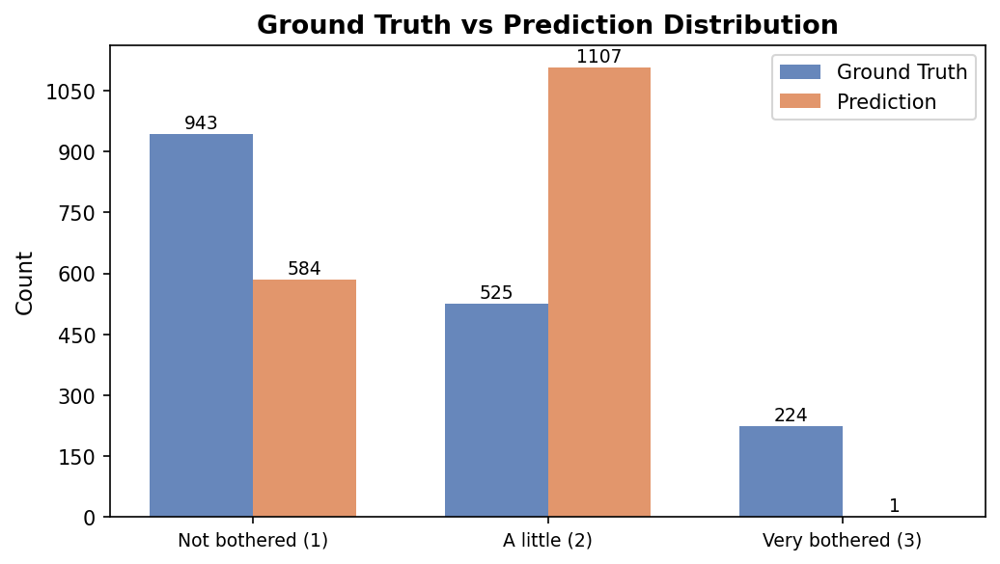
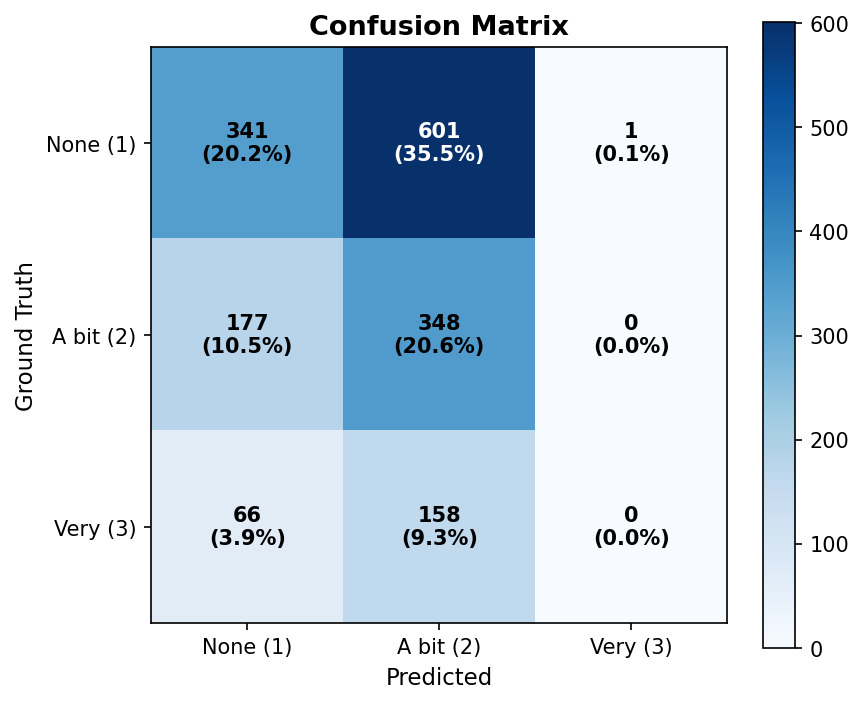
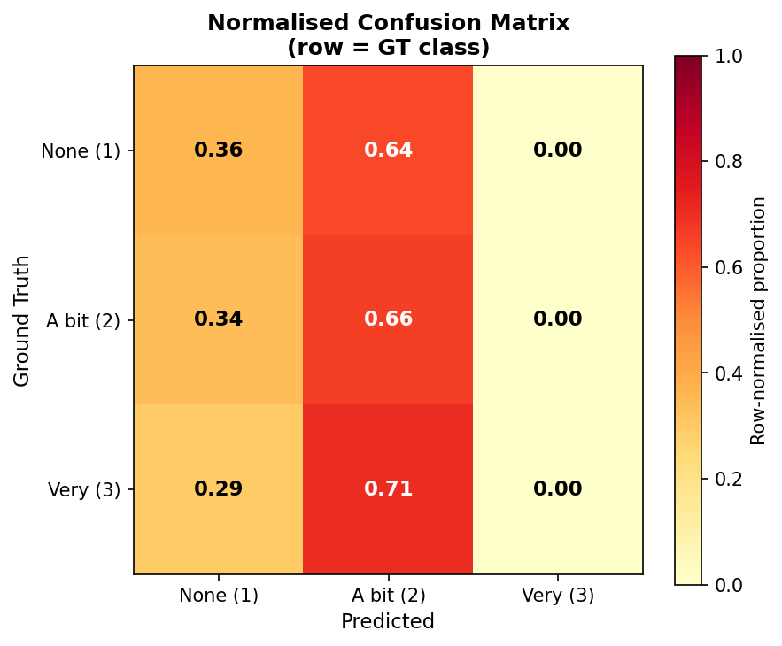
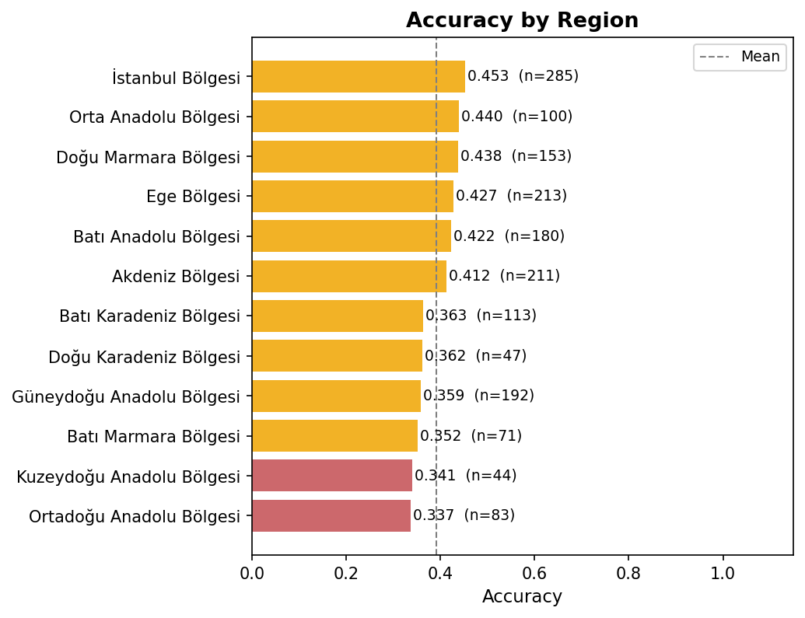
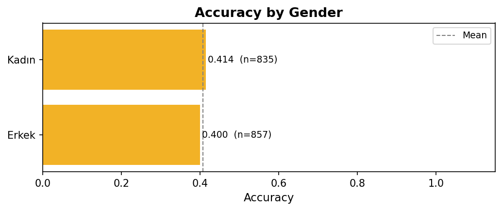
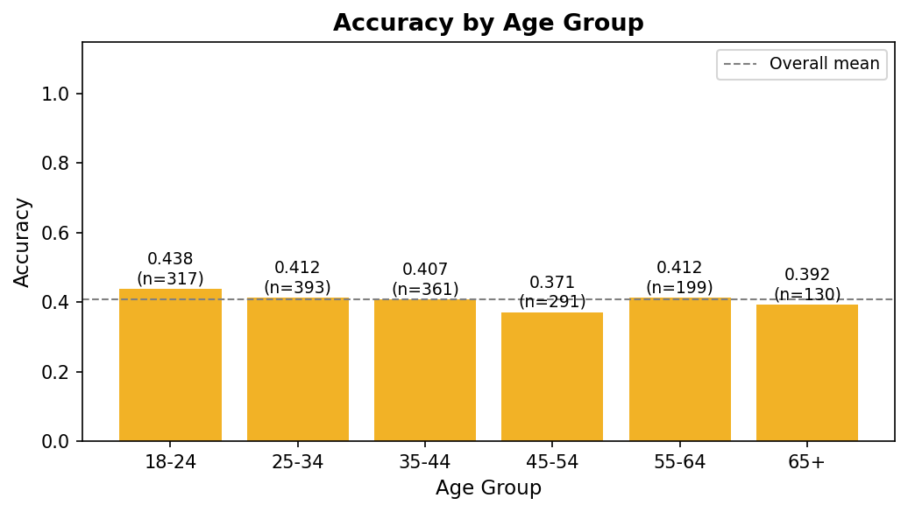

# neilang Prediction Report

**Model:** gpt-5.4-mini | **Temperature:** 0.8 | **Date:** 2026-04-18 13:38
**Source:** `neilang_predictions_20260418_132424.csv`
**Prompt cleaning:** sentences revealing `neilang` (language-neighbor) and `neirelg` (religion-neighbor) attitudes removed before inference.

---

## 1. Overall Performance

| Metric | Value |
|---|---|
| Total personas | 1692 |
| Valid predictions | 1692 |
| Parse failures | 0 |
| **Accuracy** | **0.4072** |
| Macro F1 | 0.2910 |
| Weighted F1 | 0.3812 |

---

## 2. Ground Truth vs Prediction Distribution

| Class | Ground Truth | Prediction |
|---|---|---|
| Not bothered (1) | 943 (55.7%) | 584 (34.5%) |
| A little (2) | 525 (31.0%) | 1107 (65.4%) |
| Very bothered (3) | 224 (13.2%) | 1 (0.1%) |

---

## 3. Confusion Matrix

| | **Pred None (1)** | **Pred A bit (2)** | **Pred Very (3)** |
|---|---|---|---|
| **GT None (1)** | 341 | 601 | 1 |
| **GT A bit (2)** | 177 | 348 | 0 |
| **GT Very (3)** | 66 | 158 | 0 |

---

## 4. Normalised Confusion Matrix

> Row-normalised: shows what the model predicts *given* the true class.

---

## 5. Per-class Metrics

| Class | Support | Precision | Recall | F1 |
|---|---|---|---|---|
| Not bothered (1) | 943 | 0.5839 | 0.3616 | 0.4466 |
| A little (2) | 525 | 0.3144 | 0.6629 | 0.4265 |
| Very bothered (3) | 224 | 0.0000 | 0.0000 | 0.0000 |
| **Macro avg** | 1692 | 0.2994 | 0.3415 | 0.2910 |
| **Weighted avg** | 1692 | 0.4230 | 0.4072 | 0.3812 |

---

## 6. Accuracy by Region

| Region | N | Accuracy |
|---|---|---|
| İstanbul Bölgesi | 285 | 0.4526 |
| Orta Anadolu Bölgesi | 100 | 0.4400 |
| Doğu Marmara Bölgesi | 153 | 0.4379 |
| Ege Bölgesi | 213 | 0.4272 |
| Batı Anadolu Bölgesi | 180 | 0.4222 |
| Akdeniz Bölgesi | 211 | 0.4123 |
| Batı Karadeniz Bölgesi | 113 | 0.3628 |
| Doğu Karadeniz Bölgesi | 47 | 0.3617 |
| Güneydoğu Anadolu Bölgesi | 192 | 0.3594 |
| Batı Marmara Bölgesi | 71 | 0.3521 |
| Kuzeydoğu Anadolu Bölgesi | 44 | 0.3409 |
| Ortadoğu Anadolu Bölgesi | 83 | 0.3373 |

---

## 7. Accuracy by Gender

| Gender | N | Accuracy |
|---|---|---|
| Kadın | 835 | 0.4144 |
| Erkek | 857 | 0.4002 |

---

## 8. Accuracy by Age Group

---

## 9. Notes

- neilang has **3 classes** (None / A little / Very bothered), making this harder than binary prediction.
- The model shows a strong bias toward class **2 (A little bothered)** — predicted 1107 times vs GT 525.
- Class **3 (Very bothered)** is the hardest: recall = **0.0000** (support = 224).
- Parse failures: **0** personas (`0.0%`).
