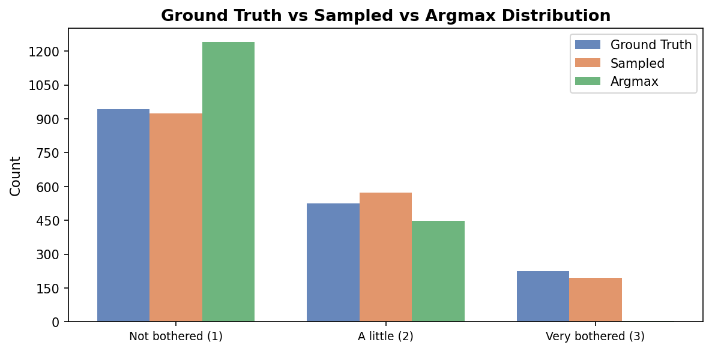
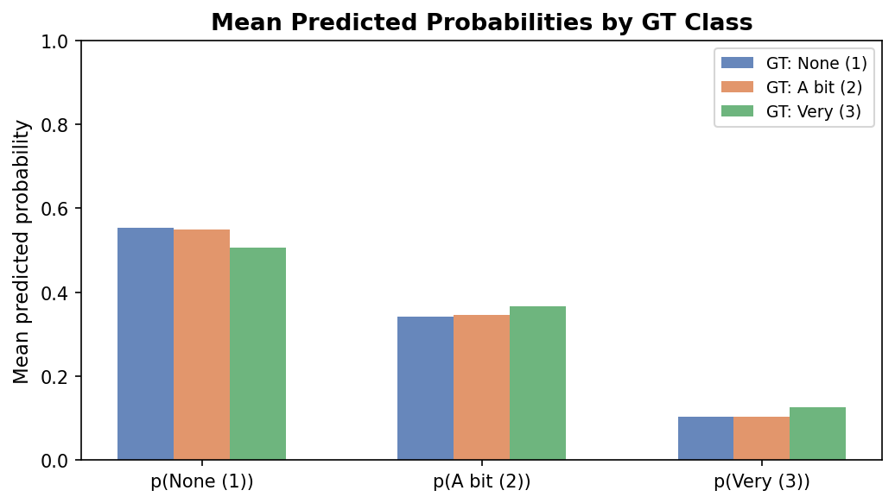
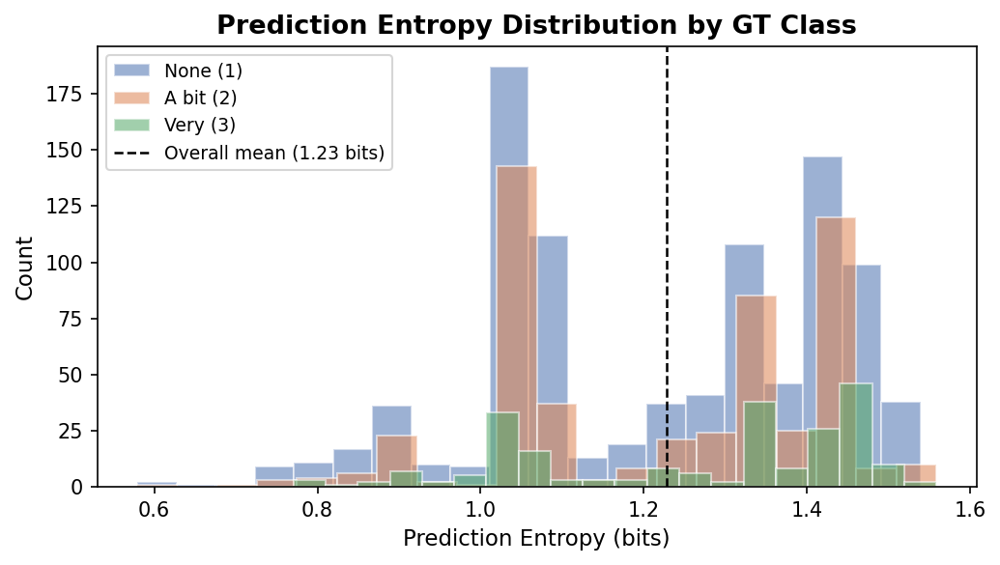
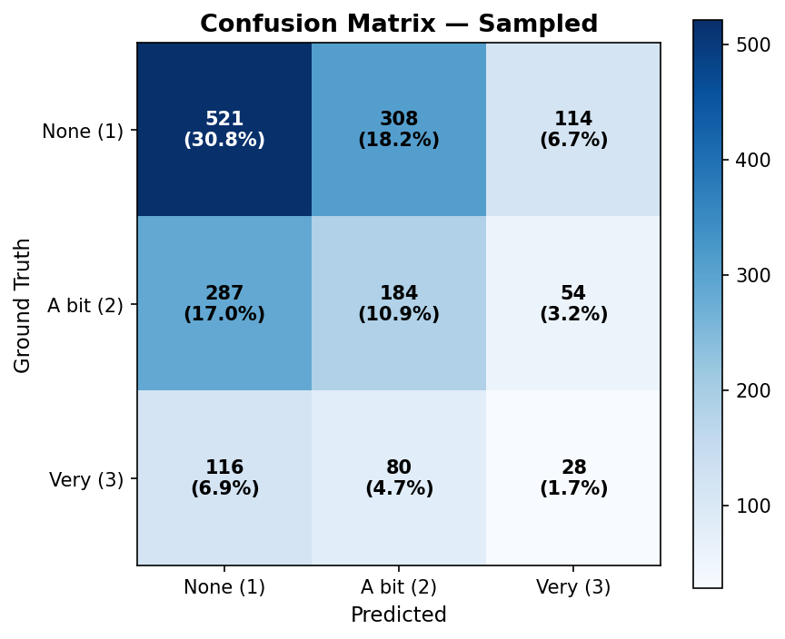
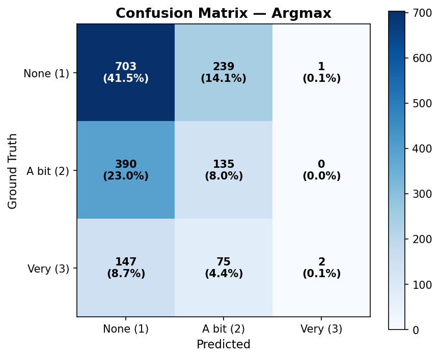
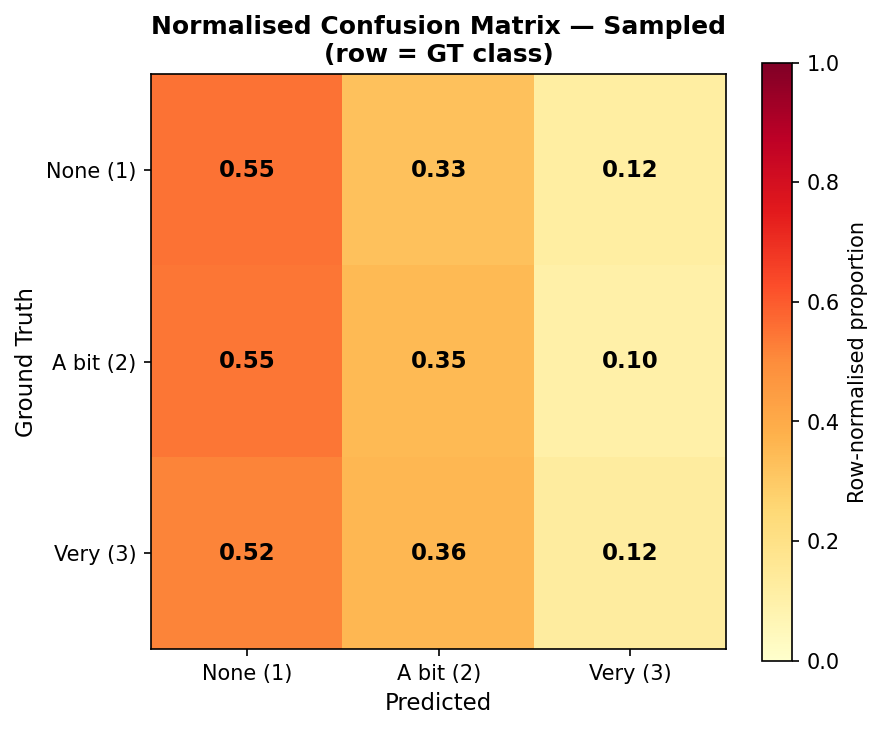
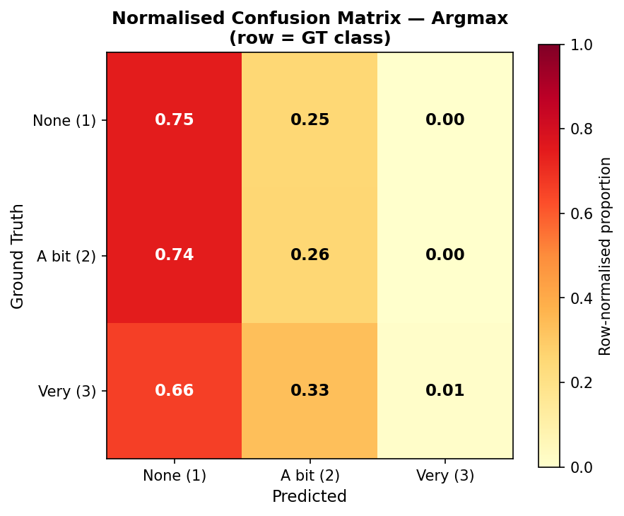
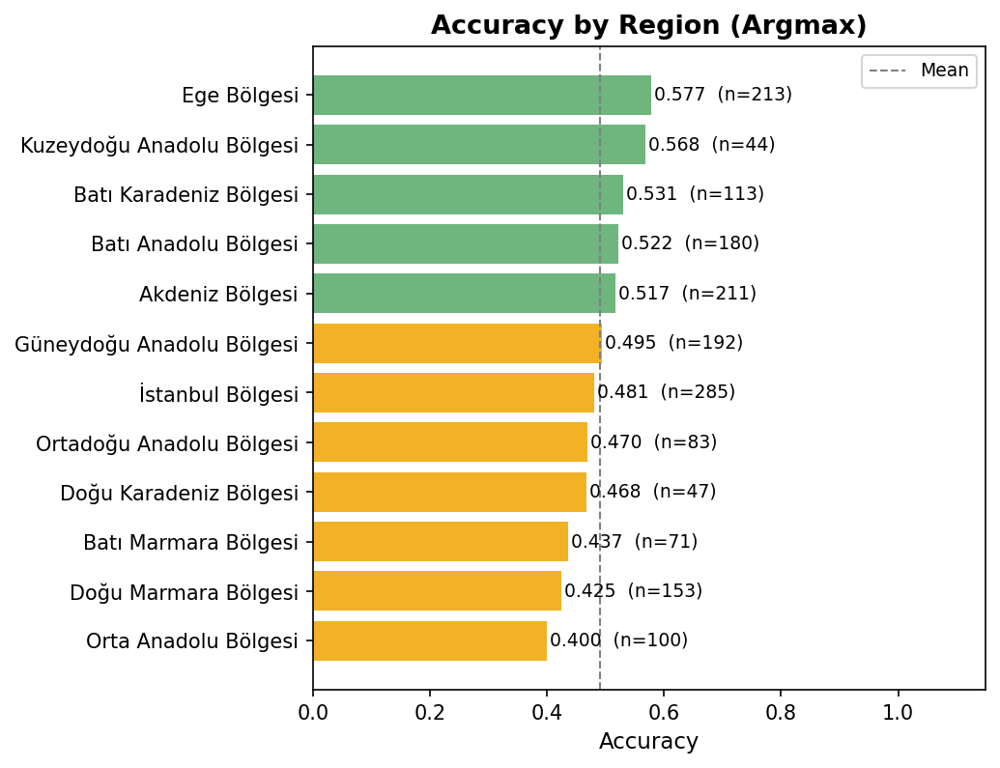
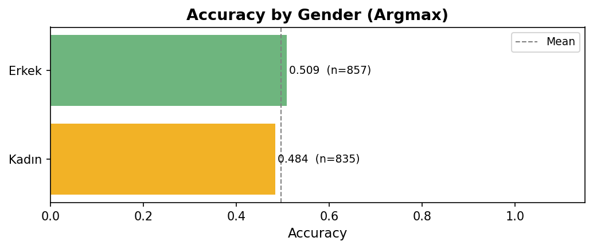
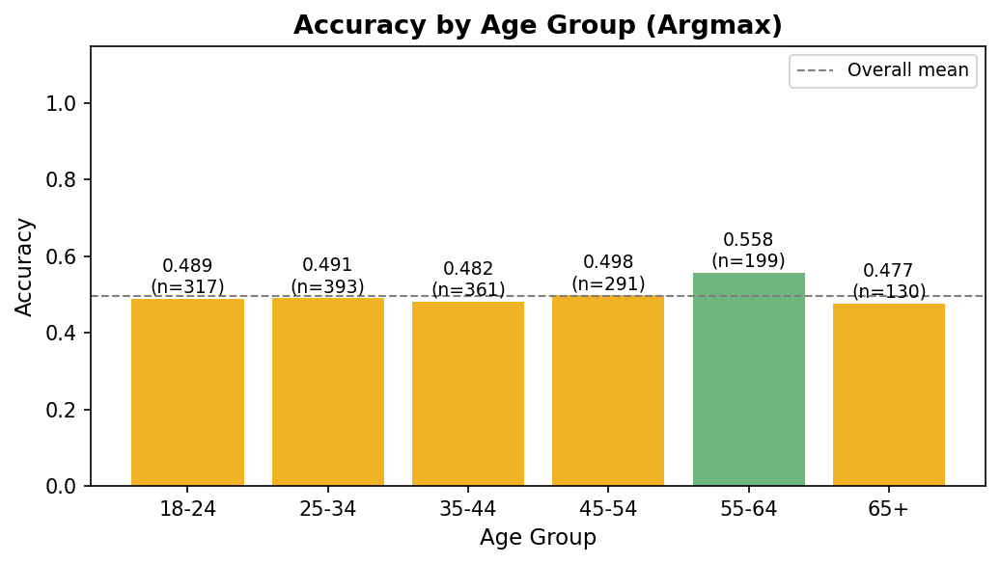

# neilang Prediction Report — Verbalized Sampling

**Model:** gpt-5.4-mini | **Temperature:** 0.8 | **Method:** Verbalized Sampling | **Date:** 2026-04-18 14:16
**Source:** `neilang_verbsampling_20260418_141028.csv`
**Prompt cleaning:** sentences revealing `neilang` (language-neighbor) and `neirelg` (religion-neighbor) attitudes removed.

> **Verbalized Sampling:** instead of predicting a single label, the model outputs a probability
> distribution over all classes (p1, p2, p3). Two predictions are derived:
> **Argmax** (deterministic — highest probability wins) and
> **Sampled** (stochastic — label drawn from the distribution).

---

## 1. Overall Performance

| Metric | Sampled | Argmax |
|---|---|---|
| Total personas | 1692 | 1692 |
| Valid predictions | 1692 | 1692 |
| Parse failures | 0 | 0 |
| **Accuracy** | **0.4332** | **0.4965** |
| Macro F1 | 0.3423 | 0.3130 |
| Weighted F1 | 0.4328 | 0.4473 |

---

## 2. Distribution: Ground Truth vs Sampled vs Argmax

---

## 3. Predicted Probability Analysis

### 3a. Mean Predicted Probabilities by GT Class

> If the model is well-calibrated, the mean p(k) should be highest when GT = k.

| | Mean p(None=1) | Mean p(A little=2) | Mean p(Very=3) |
|---|---|---|---|
| Overall | 0.5467 | 0.3459 | 0.1073 |

### 3b. Prediction Entropy

> Low entropy = high-confidence prediction. High entropy = uncertain.
> Max entropy for 3 classes = log₂(3) ≈ 1.585 bits.

| Metric | Value |
|---|---|
| Mean entropy | 1.2285 bits |
| Median entropy | 1.2740 bits |
| High-confidence predictions (entropy < 0.5) | 0 (0.0%) |

---

## 4. Confusion Matrices

### 4a. Sampled Prediction

| | **Pred None (1)** | **Pred A bit (2)** | **Pred Very (3)** |
|---|---|---|---|
| **GT None (1)** | 521 | 308 | 114 |
| **GT A bit (2)** | 287 | 184 | 54 |
| **GT Very (3)** | 116 | 80 | 28 |

### 4b. Argmax Prediction

| | **Pred None (1)** | **Pred A bit (2)** | **Pred Very (3)** |
|---|---|---|---|
| **GT None (1)** | 703 | 239 | 1 |
| **GT A bit (2)** | 390 | 135 | 0 |
| **GT Very (3)** | 147 | 75 | 2 |

---

## 5. Normalised Confusion Matrices

### 5a. Sampled

### 5b. Argmax

> Row-normalised: shows what the model predicts *given* the true class.

---

## 6. Per-class Metrics

### 6a. Sampled

| Class | Support | Precision | Recall | F1 |
|---|---|---|---|---|
| Not bothered (1) | 943 | 0.5639 | 0.5525 | 0.5581 |
| A little (2) | 525 | 0.3217 | 0.3505 | 0.3355 |
| Very bothered (3) | 224 | 0.1429 | 0.1250 | 0.1333 |
| **Macro avg** | 1692 | 0.3428 | 0.3427 | 0.3423 |
| **Weighted avg** | 1692 | 0.4330 | 0.4332 | 0.4328 |

### 6b. Argmax

| Class | Support | Precision | Recall | F1 |
|---|---|---|---|---|
| Not bothered (1) | 943 | 0.5669 | 0.7455 | 0.6441 |
| A little (2) | 525 | 0.3007 | 0.2571 | 0.2772 |
| Very bothered (3) | 224 | 0.6667 | 0.0089 | 0.0176 |
| **Macro avg** | 1692 | 0.5114 | 0.3372 | 0.3130 |
| **Weighted avg** | 1692 | 0.4975 | 0.4965 | 0.4473 |

---

## 7. Accuracy by Region (Argmax)

| Region | N | Accuracy |
|---|---|---|
| Ege Bölgesi | 213 | 0.5775 |
| Kuzeydoğu Anadolu Bölgesi | 44 | 0.5682 |
| Batı Karadeniz Bölgesi | 113 | 0.5310 |
| Batı Anadolu Bölgesi | 180 | 0.5222 |
| Akdeniz Bölgesi | 211 | 0.5166 |
| Güneydoğu Anadolu Bölgesi | 192 | 0.4948 |
| İstanbul Bölgesi | 285 | 0.4807 |
| Ortadoğu Anadolu Bölgesi | 83 | 0.4699 |
| Doğu Karadeniz Bölgesi | 47 | 0.4681 |
| Batı Marmara Bölgesi | 71 | 0.4366 |
| Doğu Marmara Bölgesi | 153 | 0.4248 |
| Orta Anadolu Bölgesi | 100 | 0.4000 |

---

## 8. Accuracy by Gender (Argmax)

| Gender | N | Accuracy |
|---|---|---|
| Erkek | 857 | 0.5088 |
| Kadın | 835 | 0.4838 |

---

## 9. Accuracy by Age Group (Argmax)

---

## 10. Notes

- Verbalized sampling yields a richer output than direct prediction: the probability
  distribution captures model uncertainty rather than a single hard label.
- **Argmax** is typically more accurate than **Sampled** since it always picks the
  most probable class, while sampling introduces stochastic noise.
- **Mean entropy** of 1.229 bits (max = 1.585) indicates the model's average
  confidence level across all personas.
- Parse failures: **0** personas
  (`0.0%`) — model did not return valid p1/p2/p3 JSON.
