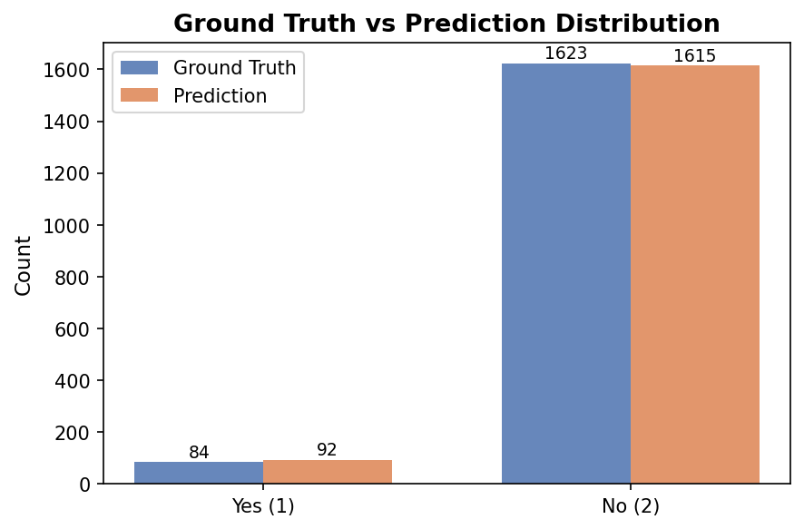
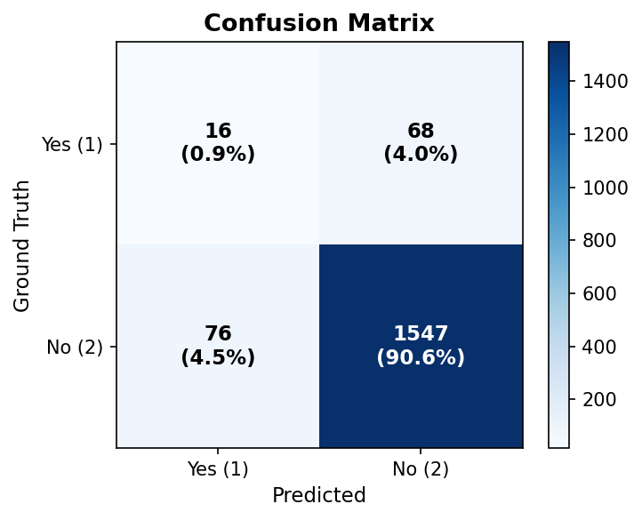
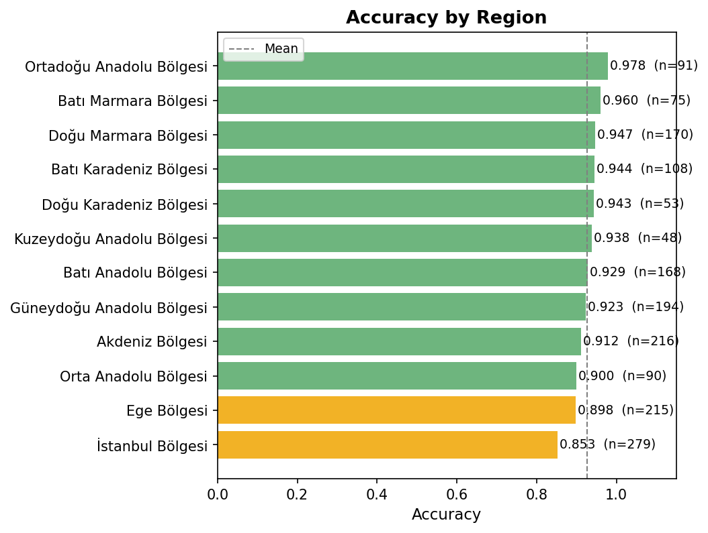
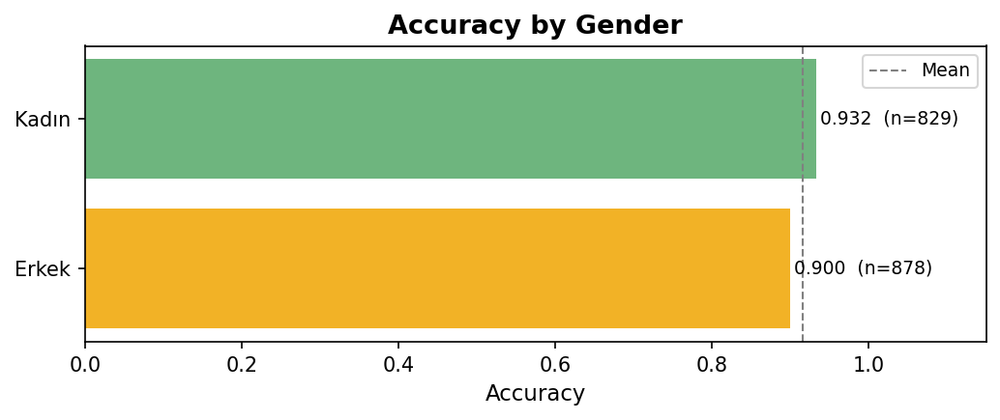
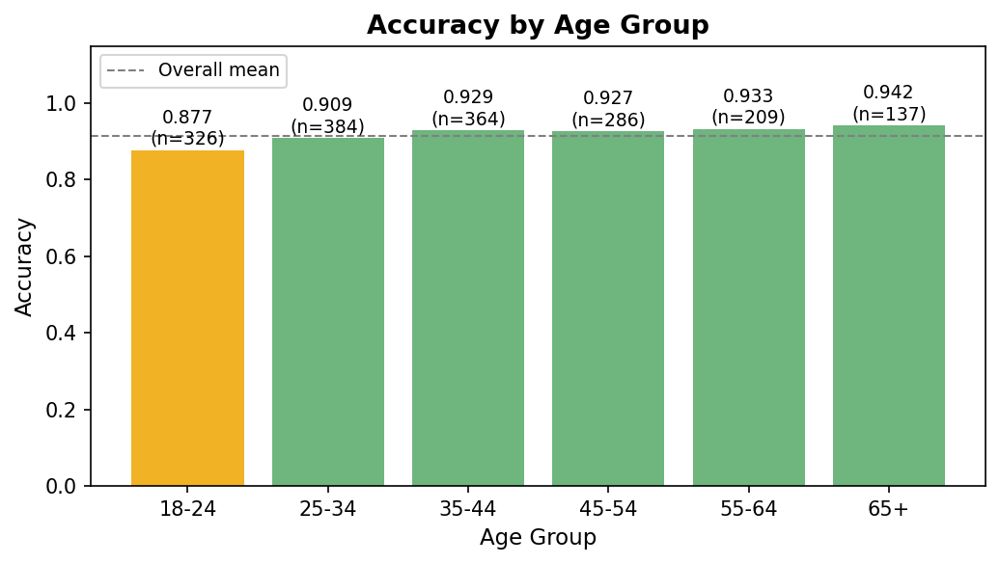

# pacdemons Prediction Report

**Model:** gpt-5.4-mini  
**Temperature:** 0.8  
**Date:** 2026-04-18 12:59  
**Source:** `pacdemons_predictions_20260418_123339.csv`

---

## 1. Overall Performance

| Metric | Value |
|---|---|
| Total personas | 1707 |
| Valid predictions | 1707 |
| Parse failures | 0 |
| **Accuracy** | **0.9156** |
| Macro F1 | 0.5687 |
| Weighted F1 | 0.9175 |

---

## 2. Ground Truth vs Prediction Distribution

| | Ground Truth | Prediction |
|---|---|---|
| Yes (1) | 84 | 92 |
| No (2) | 1623 | 1615 |

> Ground truth "Yes" rate: **4.9%**  
> Model "Yes" rate: **5.4%**

---

## 3. Confusion Matrix

| | **Pred Yes (1)** | **Pred No (2)** |
|---|---|---|
| **GT Yes (1)** | 16 | 68 |
| **GT No (2)** | 76 | 1547 |

---

## 4. Per-class Metrics

| Class | Support | Precision | Recall | F1 |
|---|---|---|---|---|
| Yes (1) | 84 | 0.1739 | 0.1905 | 0.1818 |
| No (2) | 1623 | 0.9579 | 0.9532 | 0.9555 |
| **Macro avg** | 1707 | 0.5659 | 0.5718 | 0.5687 |
| **Weighted avg** | 1707 | 0.9193 | 0.9156 | 0.9175 |

---

## 5. Accuracy by Region

| Region | N | Accuracy |
|---|---|---|
| Ortadoğu Anadolu Bölgesi | 91 | 0.9780 |
| Batı Marmara Bölgesi | 75 | 0.9600 |
| Doğu Marmara Bölgesi | 170 | 0.9471 |
| Batı Karadeniz Bölgesi | 108 | 0.9444 |
| Doğu Karadeniz Bölgesi | 53 | 0.9434 |
| Kuzeydoğu Anadolu Bölgesi | 48 | 0.9375 |
| Batı Anadolu Bölgesi | 168 | 0.9286 |
| Güneydoğu Anadolu Bölgesi | 194 | 0.9227 |
| Akdeniz Bölgesi | 216 | 0.9120 |
| Orta Anadolu Bölgesi | 90 | 0.9000 |
| Ege Bölgesi | 215 | 0.8977 |
| İstanbul Bölgesi | 279 | 0.8530 |

---

## 6. Accuracy by Gender

| Gender | N | Accuracy |
|---|---|---|
| Kadın | 829 | 0.9324 |
| Erkek | 878 | 0.8998 |

---

## 7. Accuracy by Age Group

---

## 8. Notes

- The model correctly reflects class imbalance: the ground truth "Yes" rate is only **4.9%**, and the model predominantly predicts **No**.
- High overall accuracy is largely driven by the majority class.
- Recall for the "Yes" class is only **0.1905**.
- Parse failures: **0** personas (**0.0%**).
