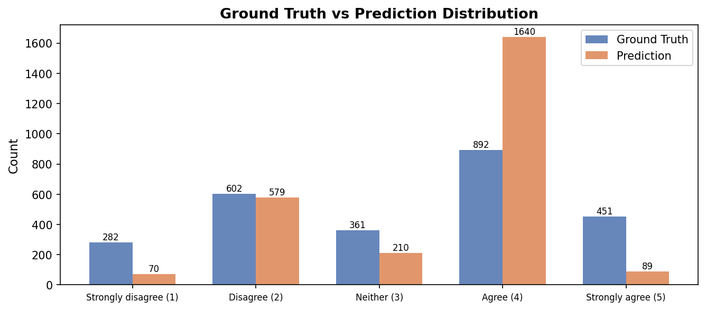
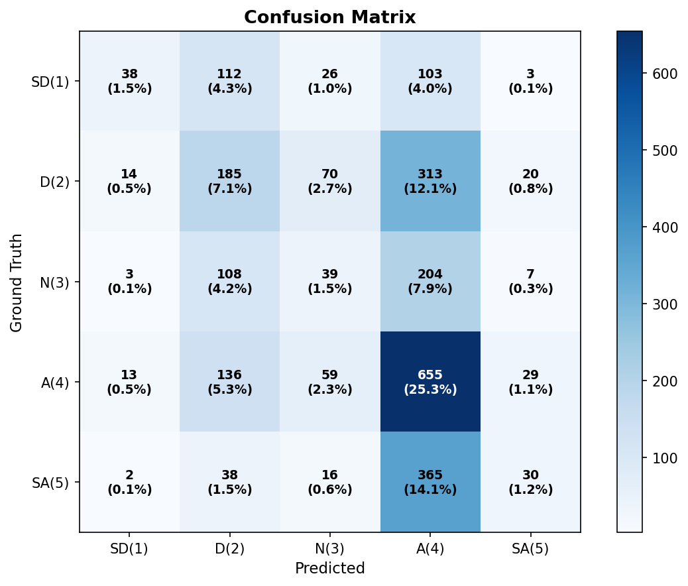
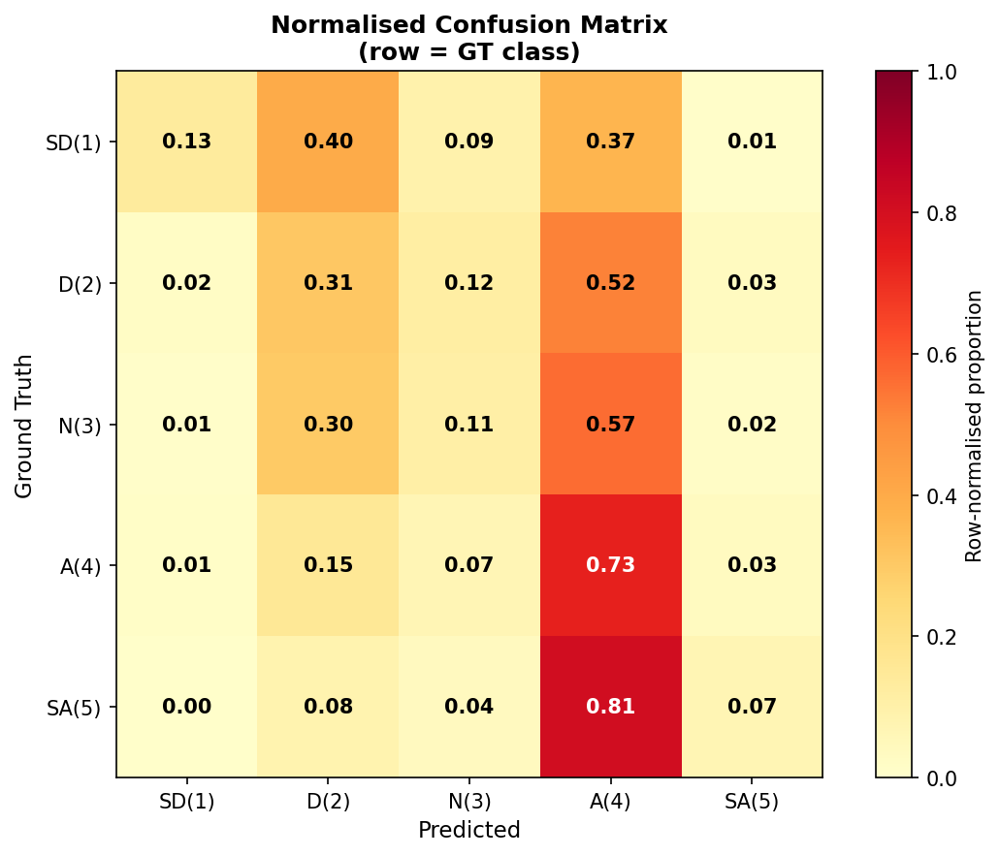
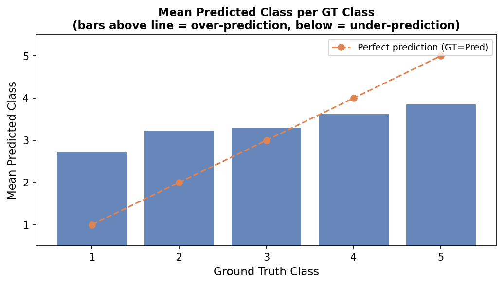
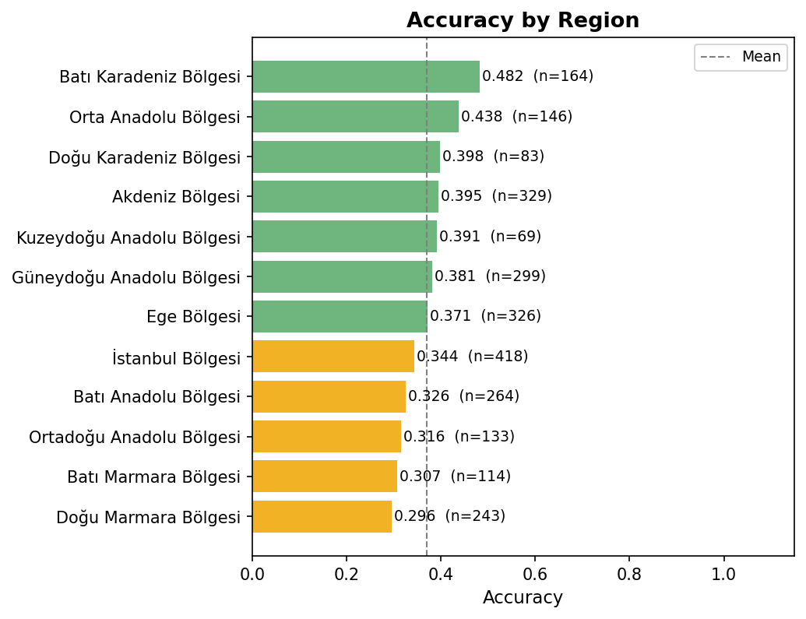
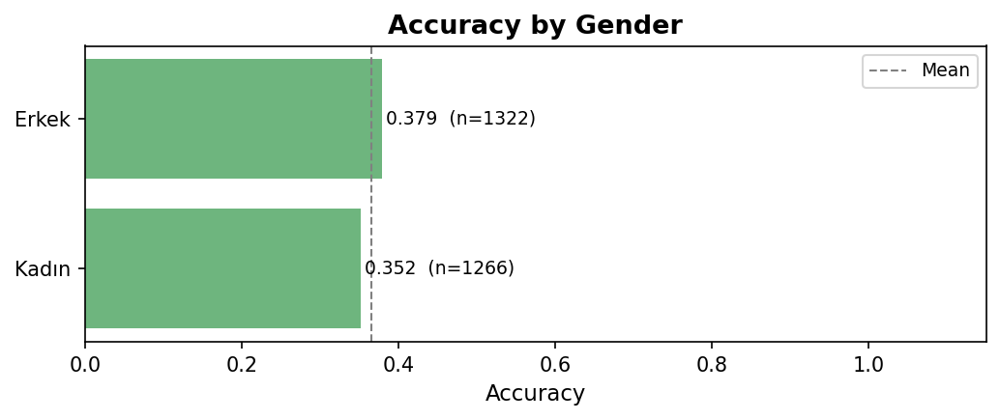
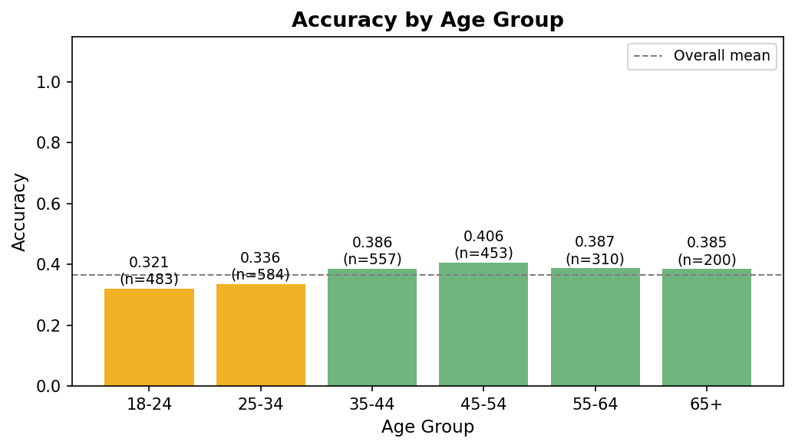

# womenwork Prediction Report

**Model:** gpt-5.4-mini | **Temperature:** 0.8 | **Date:** 2026-04-18 18:53
**Source:** `womenwork_predictions_20260418_150533.csv`
**Question:** *"A man's job is to earn money; a woman's job is to look after the home and family."*
(1 = Strongly disagree → 5 = Strongly agree)
**Prompt cleaning:** sentences revealing gender-role attitudes (`geleneksel cinsiyet rolleri`, `evin reisinin erkek`) removed before inference.

---

## 1. Overall Performance

| Metric | Value |
|---|---|
| Total personas | 2588 |
| Valid predictions | 2588 |
| Parse failures | 0 |
| **Accuracy** | **0.3659** |
| Macro F1 | 0.2589 |
| Weighted F1 | 0.3131 |

> Note: 5-class prediction — random baseline accuracy ≈ 0.20.

---

## 2. Ground Truth vs Prediction Distribution

| Class | Ground Truth | Prediction |
|---|---|---|
| Strongly disagree (1) | 282 (10.9%) | 70 (2.7%) |
| Disagree (2) | 602 (23.3%) | 579 (22.4%) |
| Neither (3) | 361 (13.9%) | 210 (8.1%) |
| Agree (4) | 892 (34.5%) | 1640 (63.4%) |
| Strongly agree (5) | 451 (17.4%) | 89 (3.4%) |

---

## 3. Confusion Matrix

| | **Pred SD(1)** | **Pred D(2)** | **Pred N(3)** | **Pred A(4)** | **Pred SA(5)** |
|---|---|---|---|---|---|
| **GT SD(1)** | 38 | 112 | 26 | 103 | 3 |
| **GT D(2)** | 14 | 185 | 70 | 313 | 20 |
| **GT N(3)** | 3 | 108 | 39 | 204 | 7 |
| **GT A(4)** | 13 | 136 | 59 | 655 | 29 |
| **GT SA(5)** | 2 | 38 | 16 | 365 | 30 |

---

## 4. Normalised Confusion Matrix

> Row-normalised: shows what the model predicts *given* the true class.

---

## 5. Prediction Bias by GT Class

> Bars above the dashed line = model over-predicts (biased toward agreement);
> bars below = model under-predicts (biased toward disagreement).

---

## 6. Per-class Metrics

| Class | Support | Precision | Recall | F1 |
|---|---|---|---|---|
| Strongly disagree (1) | 282 | 0.5429 | 0.1348 | 0.2159 |
| Disagree (2) | 602 | 0.3195 | 0.3073 | 0.3133 |
| Neither (3) | 361 | 0.1857 | 0.1080 | 0.1366 |
| Agree (4) | 892 | 0.3994 | 0.7343 | 0.5174 |
| Strongly agree (5) | 451 | 0.3371 | 0.0665 | 0.1111 |
| **Macro avg** | 2588 | 0.3569 | 0.2702 | 0.2589 |
| **Weighted avg** | 2588 | 0.3558 | 0.3659 | 0.3131 |

---

## 7. Accuracy by Region

| Region | N | Accuracy |
|---|---|---|
| Batı Karadeniz Bölgesi | 164 | 0.4817 |
| Orta Anadolu Bölgesi | 146 | 0.4384 |
| Doğu Karadeniz Bölgesi | 83 | 0.3976 |
| Akdeniz Bölgesi | 329 | 0.3951 |
| Kuzeydoğu Anadolu Bölgesi | 69 | 0.3913 |
| Güneydoğu Anadolu Bölgesi | 299 | 0.3813 |
| Ege Bölgesi | 326 | 0.3712 |
| İstanbul Bölgesi | 418 | 0.3445 |
| Batı Anadolu Bölgesi | 264 | 0.3258 |
| Ortadoğu Anadolu Bölgesi | 133 | 0.3158 |
| Batı Marmara Bölgesi | 114 | 0.3070 |
| Doğu Marmara Bölgesi | 243 | 0.2963 |

---

## 8. Accuracy by Gender

| Gender | N | Accuracy |
|---|---|---|
| Erkek | 1322 | 0.3790 |
| Kadın | 1266 | 0.3523 |

---

## 9. Accuracy by Age Group

---

## 10. Notes

- **5-class** prediction with ordinal scale — adjacent-class errors are less costly than cross-scale errors.
- Parse failures: **0** personas (`0.0%`).
- Ground truth distribution: majority class = 4 (892 personas, 34.5%).
