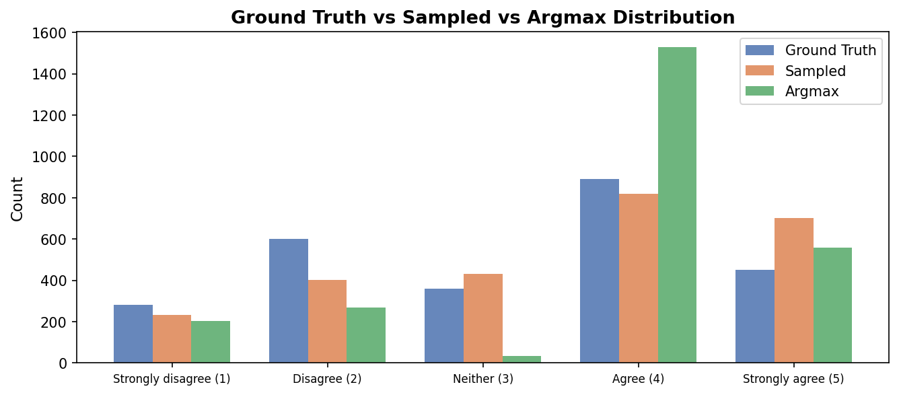
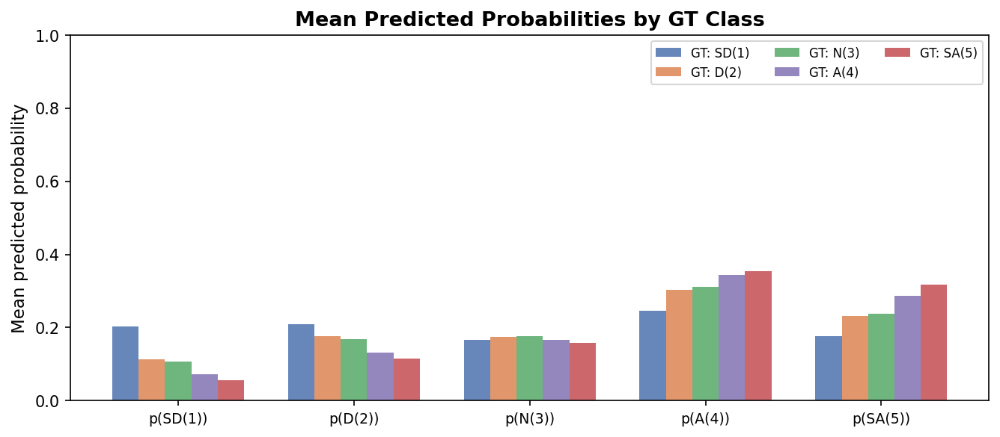
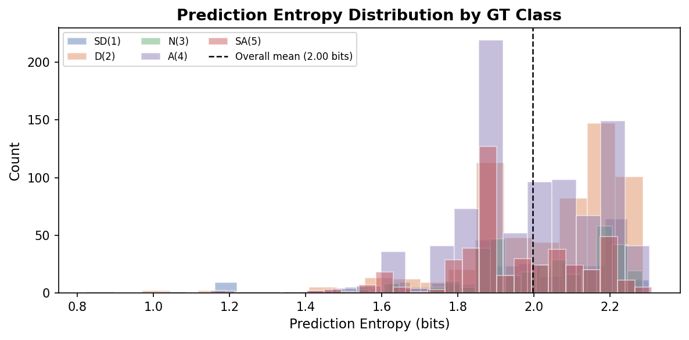
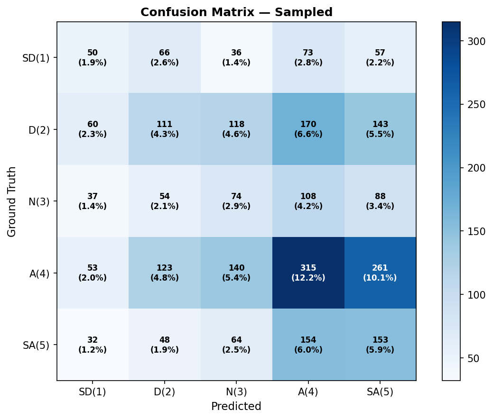
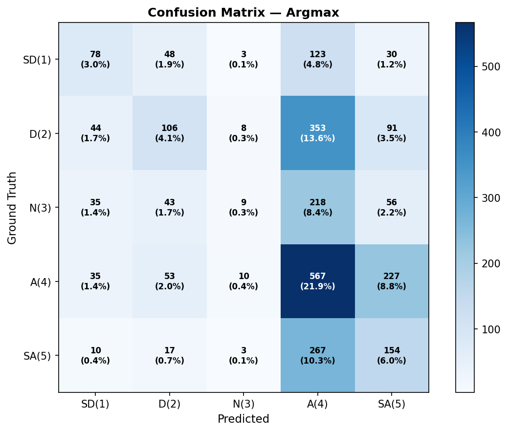
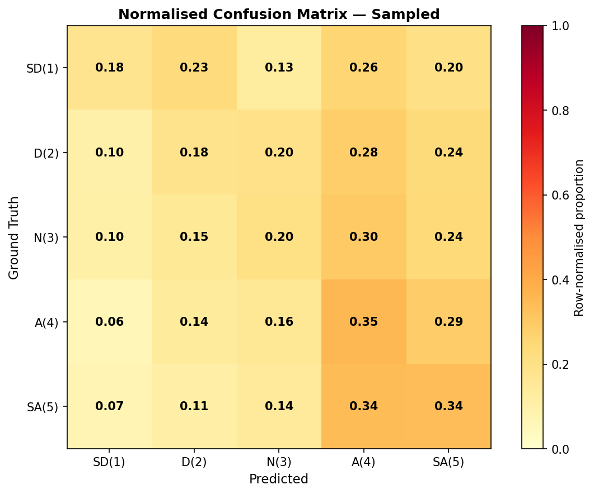
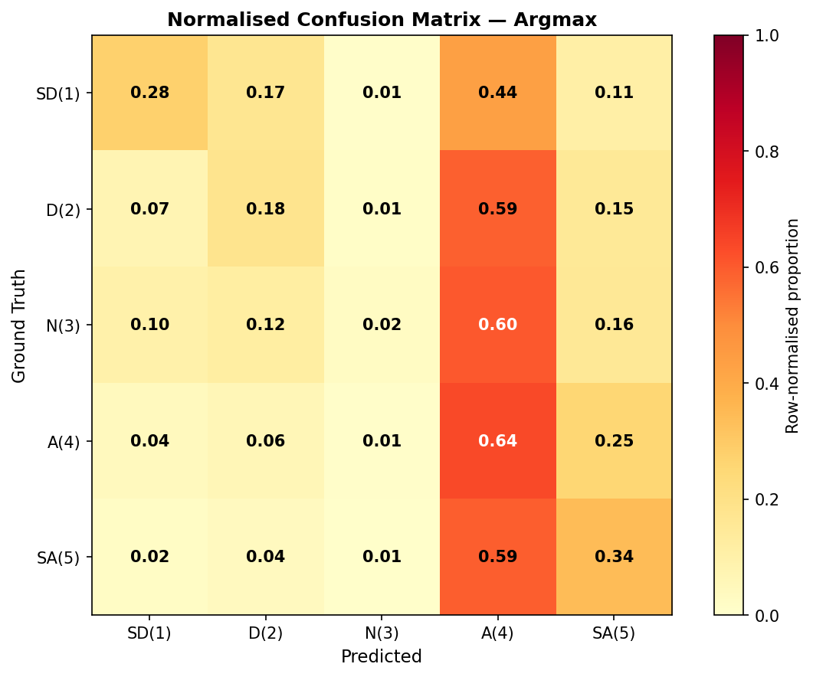
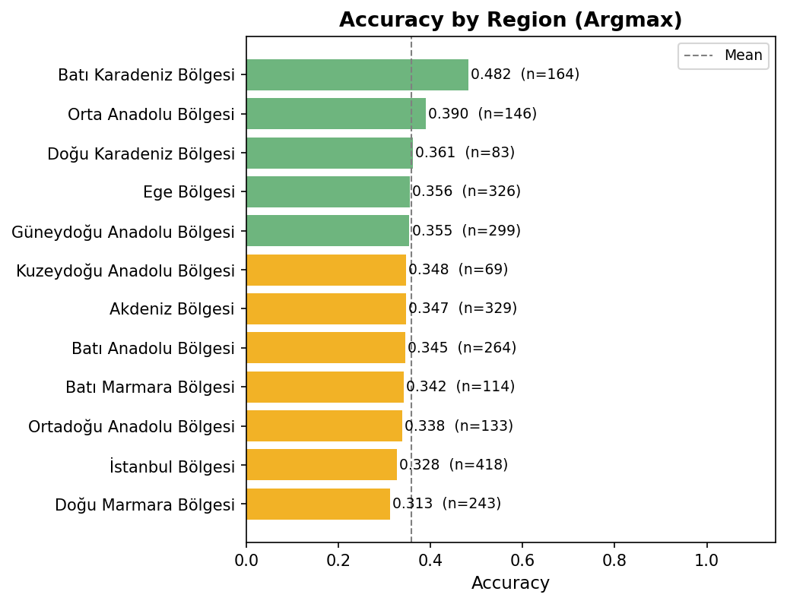
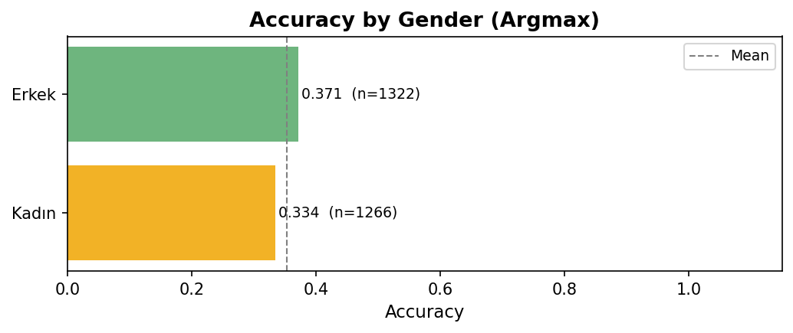
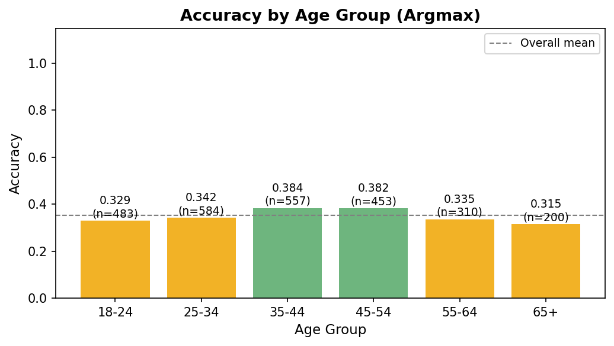

# womenwork Prediction Report — Verbalized Sampling

**Model:** gpt-5.4-mini | **Temperature:** 0.8 | **Method:** Verbalized Sampling | **Date:** 2026-04-18 19:06
**Source:** `womenwork_verbsampling_20260418_185933.csv`
**Question:** *"A man's job is to earn money; a woman's job is to look after the home and family."*
(1 = Strongly disagree → 5 = Strongly agree)
**Prompt cleaning:** sentences revealing gender-role attitudes removed before inference.

> **Verbalized Sampling:** the model outputs a probability distribution (p1–p5) over all classes.
> **Argmax** = deterministic (highest probability wins). **Sampled** = drawn from the distribution.

---

## 1. Overall Performance

| Metric | Sampled | Argmax |
|---|---|---|
| Total personas | 2588 | 2588 |
| Valid predictions | 2588 | 2588 |
| Parse failures | 0 | 0 |
| **Accuracy** | **0.2716** | **0.3532** |
| Macro F1 | 0.2471 | 0.2772 |
| Weighted F1 | 0.2718 | 0.3129 |

> 5-class random baseline ≈ 0.20

---

## 2. Distribution: Ground Truth vs Sampled vs Argmax

---

## 3. Predicted Probability Analysis

### 3a. Mean Predicted Probabilities by GT Class

| | p(SD=1) | p(D=2) | p(N=3) | p(A=4) | p(SA=5) |
|---|---|---|---|---|---|
| Overall mean | 0.0979 | 0.1524 | 0.1683 | 0.3208 | 0.2607 |

### 3b. Prediction Entropy

| Metric | Value |
|---|---|
| Mean entropy | 1.9973 bits |
| Median entropy | 2.0087 bits |
| Max possible (5 classes) | 2.322 bits |
| High-confidence predictions (entropy < 0.5) | 0 (0.0%) |

---

## 4. Confusion Matrices

### 4a. Sampled

| | **Pred SD(1)** | **Pred D(2)** | **Pred N(3)** | **Pred A(4)** | **Pred SA(5)** |
|---|---|---|---|---|---|
| **GT SD(1)** | 50 | 66 | 36 | 73 | 57 |
| **GT D(2)** | 60 | 111 | 118 | 170 | 143 |
| **GT N(3)** | 37 | 54 | 74 | 108 | 88 |
| **GT A(4)** | 53 | 123 | 140 | 315 | 261 |
| **GT SA(5)** | 32 | 48 | 64 | 154 | 153 |

### 4b. Argmax

| | **Pred SD(1)** | **Pred D(2)** | **Pred N(3)** | **Pred A(4)** | **Pred SA(5)** |
|---|---|---|---|---|---|
| **GT SD(1)** | 78 | 48 | 3 | 123 | 30 |
| **GT D(2)** | 44 | 106 | 8 | 353 | 91 |
| **GT N(3)** | 35 | 43 | 9 | 218 | 56 |
| **GT A(4)** | 35 | 53 | 10 | 567 | 227 |
| **GT SA(5)** | 10 | 17 | 3 | 267 | 154 |

---

## 5. Normalised Confusion Matrices

### 5a. Sampled

### 5b. Argmax

---

## 6. Per-class Metrics

### 6a. Sampled

| Class | Support | Precision | Recall | F1 |
|---|---|---|---|---|
| Strongly disagree (1) | 282 | 0.2155 | 0.1773 | 0.1946 |
| Disagree (2) | 602 | 0.2761 | 0.1844 | 0.2211 |
| Neither (3) | 361 | 0.1713 | 0.2050 | 0.1866 |
| Agree (4) | 892 | 0.3841 | 0.3531 | 0.3680 |
| Strongly agree (5) | 451 | 0.2179 | 0.3392 | 0.2654 |
| **Macro avg** | 2588 | 0.2530 | 0.2518 | 0.2471 |
| **Weighted avg** | 2588 | 0.2820 | 0.2716 | 0.2718 |

### 6b. Argmax

| Class | Support | Precision | Recall | F1 |
|---|---|---|---|---|
| Strongly disagree (1) | 282 | 0.3861 | 0.2766 | 0.3223 |
| Disagree (2) | 602 | 0.3970 | 0.1761 | 0.2440 |
| Neither (3) | 361 | 0.2727 | 0.0249 | 0.0457 |
| Agree (4) | 892 | 0.3711 | 0.6357 | 0.4686 |
| Strongly agree (5) | 451 | 0.2760 | 0.3415 | 0.3053 |
| **Macro avg** | 2588 | 0.3406 | 0.2909 | 0.2772 |
| **Weighted avg** | 2588 | 0.3485 | 0.3532 | 0.3129 |

---

## 7. Accuracy by Region (Argmax)

| Region | N | Accuracy |
|---|---|---|
| Batı Karadeniz Bölgesi | 164 | 0.4817 |
| Orta Anadolu Bölgesi | 146 | 0.3904 |
| Doğu Karadeniz Bölgesi | 83 | 0.3614 |
| Ege Bölgesi | 326 | 0.3558 |
| Güneydoğu Anadolu Bölgesi | 299 | 0.3545 |
| Kuzeydoğu Anadolu Bölgesi | 69 | 0.3478 |
| Akdeniz Bölgesi | 329 | 0.3465 |
| Batı Anadolu Bölgesi | 264 | 0.3447 |
| Batı Marmara Bölgesi | 114 | 0.3421 |
| Ortadoğu Anadolu Bölgesi | 133 | 0.3383 |
| İstanbul Bölgesi | 418 | 0.3278 |
| Doğu Marmara Bölgesi | 243 | 0.3128 |

---

## 8. Accuracy by Gender (Argmax)

| Gender | N | Accuracy |
|---|---|---|
| Erkek | 1322 | 0.3714 |
| Kadın | 1266 | 0.3341 |

---

## 9. Accuracy by Age Group (Argmax)

---

## 10. Notes

- Parse failures: **0** personas (`0.0%`).
- Mean entropy 1.997 bits out of max 2.322 — model is quite uncertain on average.
- Argmax accuracy (0.3532) vs direct prediction baseline for comparison.
